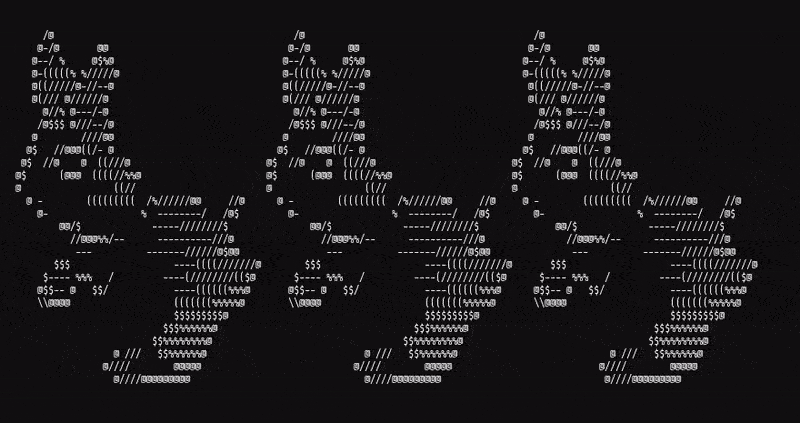
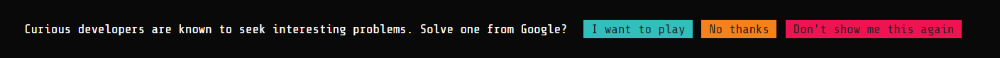
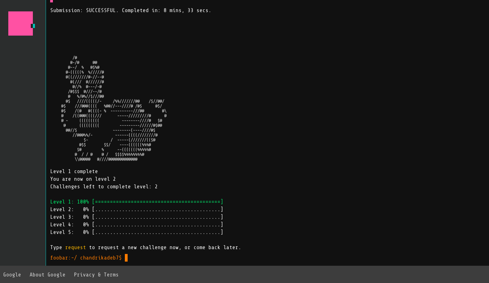
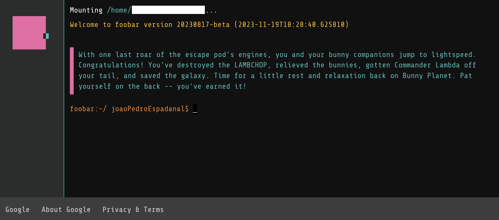

# Google FooBar

One day, I was searching on Google and something strange happened.

The search results page broke open (it got inclined backwards)to reveal the message

Google foobar or foo.bar, is Google's secret recruiting process embedded within their search engine. Generally It is not accessible.
You have to get invited by someone who's already in the system, or Google selects you and invites you triggered byt what you search.
Although it is a funny secret recruiting process, I believe they no longer use it to recruit. 

There are 5 levels, each with a different number of challenges that follow a story.
They save a journal of your story [jornal](./journal.md)

# Challenges 
### Level 1
- [Solar Doomsday](./level-1/1.0-solar-doomsday/problem.md)

### Level 2
- [2.1 Can't remember the name](./level-2/2.1/problem.md)
- [2.2 Don't Get Volunteered](./level-2/2.2-dont-get-volunteered/problem.md)

### Level 3
- [3.1 The Grandest Staircase Of Them All](level-3/3.1-the-grandest-staircase-of-them-all/problem.md)
- [3.2 Doomsday Fuel](./level-3/3.2-doomsday-fuel/problem.md)
- [3.3 Queue To Do](level-3/3.3-queue-to-do/problem.md)

At this point, you are asked to send your solutions to a Google recruiter.
And can invite someone to the challenge.

### Level 4
- [4.1 BringingA Gun To A Trainer Fight](./level-4/4.1-bringing-a-gun-to-a-trainer-fight/problem.md)
- [4.2 Running With Bunnies](./level-4/4.2-running-with-bunnies/problem.md)

### Level 5
- [Disorderly Escape](./level-5/5.1-disorderly-escape/problem.md)

